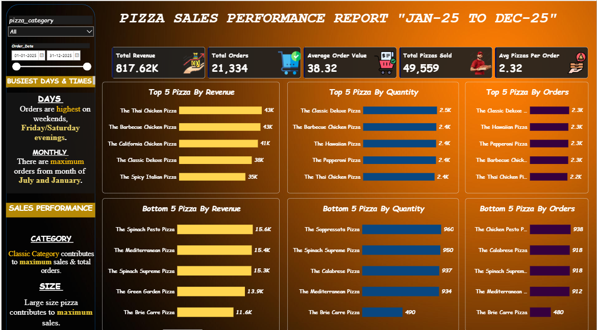
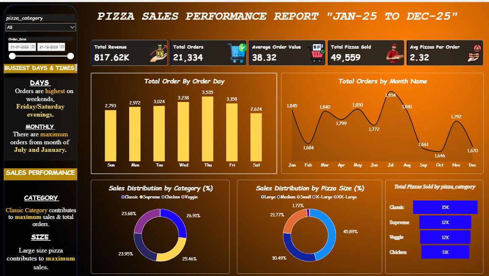

**🍕 Pizza Sales Performance Dashboard**

An end-to-end Data Analytics project that analyzes pizza sales data using PostgreSQL, Python, Pandas, NumPy, and Power BI to uncover business insights and support data-driven decision-making.

**📌 Project Overview**

The Pizza Sales Performance Dashboard is an interactive Business Intelligence solution built to analyze pizza sales data from multiple business perspectives. The project demonstrates the complete analytics workflow—from data extraction and transformation to visualization and business storytelling.
Using PostgreSQL for querying, Python (Pandas & NumPy) for data preparation, and Power BI for dashboard development, this project provides actionable insights into revenue, customer behaviour, product performance, and sales trends.

🎯 Business Objective

The objective of this project is to help restaurant owners and decision-makers:

Monitor overall business performance
Track sales trends over time
Identify top and low-performing pizzas
Understand customer ordering behaviour
Analyse product categories and pizza sizes
Improve inventory planning
Increase revenue through data-driven decisions

**📊 Dashboard Pages**
📈 Dashboard 1 — Sales Overview
KPIs
💰 Total Revenue
🛒 Total Orders
🍕 Total Pizzas Sold
💳 Average Order Value
📦 Average Pizzas Per Order

📊 Dashboard 2 — Product Performance
**Top Performing Products**
Top 5 Pizzas by Revenue
Top 5 Pizzas by Quantity
Top 5 Pizzas by Orders
**Bottom Performing Products**
Bottom 5 Pizzas by Revenue
Bottom 5 Pizzas by Quantity
Bottom 5 Pizzas by Orders

**💼 Business Recommendations**
Increase inventory during weekends and peak months.
Promote low-selling pizzas through discounts and combo offers.
Focus marketing campaigns on best-selling pizza categories.
Optimise menu offerings based on customer demand.
Use sales trends for inventory and workforce planning.

****🛠️ Tools & Technologies Used**
Technology    Purpose
Power BI	  Dashboard Development & Data Visualization
PostgreSQL	  SQL Queries & Data Extraction
Python	      Data Cleaning & Analysis
Pandas	      Data Manipulation & Transformation
NumPy	      Numerical Computations
Power Query	  Data Cleaning & ETL
DAX	          KPI Calculations & Business Metrics**

# 📷 Dashboard Preview

## Sales Overview

---

## Product Performance

---

Done By : 
Vinoth.M

Linked in : www.linkedin.com/in/m-vinoth-1326122b4
